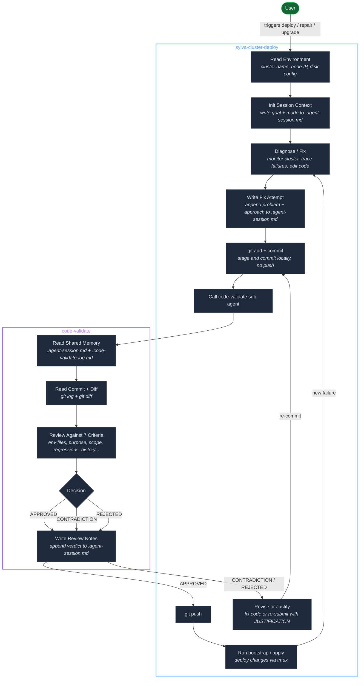
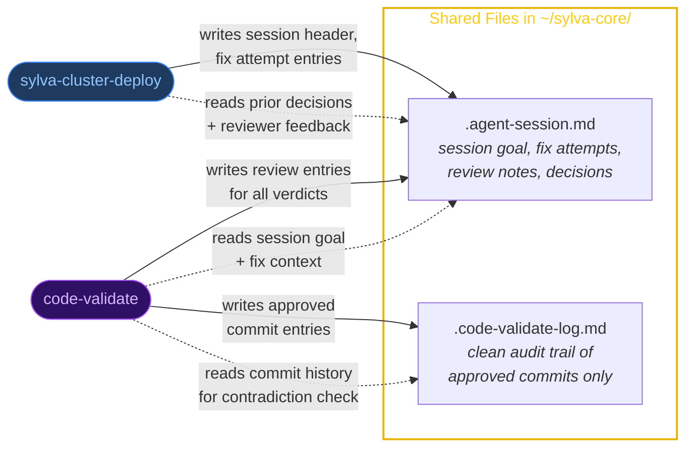
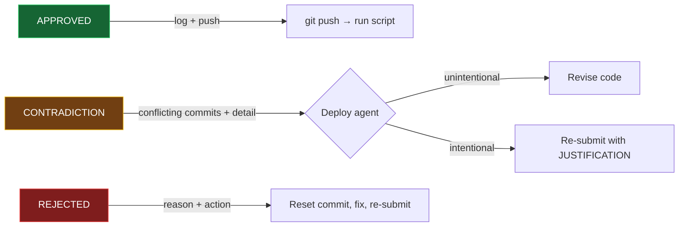

# Claude Skills

Cursor agent skills for Sylva infrastructure automation.

## Skills

### sylva-cluster-deploy

Deploy, repair, upgrade, and redeploy Sylva OKD management clusters on bare metal (cabpoa/capm3). Runs bootstrap.sh or apply.sh, monitors Flux kustomizations, diagnoses failures, applies code fixes, and retries until all units are ready.

**Capabilities:**

- Full redeploy from scratch (teardown + bootstrap.sh)
- Repair mode (diagnose failures, apply fixes, retry)
- Upgrade mode (enable/disable units, version upgrades, config changes via apply.sh)
- Active monitoring of kustomizations, HelmReleases, pods, and ACI events
- Known issue catalog with tested fixes
- Health check script for quick status assessment
- Automatic retry loop until all Sylva units are ready

All code changes go through the **code-validate** agent before being pushed.

```
sylva-cluster-deploy/
├── SKILL.md
├── encountered-issues.md
├── known-issues.md
└── scripts/
    └── check-cluster-health.sh
```

---

### code-validate

Gate-keeper agent that reviews code changes before they are pushed. Called as a sub-agent by sylva-cluster-deploy after committing but before pushing.

**What it does:**

- Reads the shared session context to understand the full session history
- Reviews commit diffs for purpose alignment, scope limitation, and regressions
- Checks for contradictions with previously approved commits
- Returns `APPROVED`, `CONTRADICTION`, or `REJECTED` with actionable details
- Logs approved commits to a clean audit trail
- Supports re-submission with justification for intentional contradictions

```
code-validate/
└── SKILL.md
```

---

## Shared Agent Memory

Both agents read and write shared files in `~/sylva-core/`:


| File                    | Purpose                                                                                    | Writers       |
| ----------------------- | ------------------------------------------------------------------------------------------ | ------------- |
| `.agent-session.md`     | Shared memory — session goal, fix attempts with reasoning, review notes from code-validate | Both          |
| `.code-validate-log.md` | Clean audit trail of approved commits only                                                 | code-validate |


## Architecture

Two-agent system for deploying and validating code changes on Sylva OKD management clusters.

### Workflow



### Shared Memory



### Decision Outcomes



---

## Setup

Git clone the repo to home directory:

```bash
git clone https://github.com/AbhishekBandarupalle/claude-skills.git ~/claude-skills
```

If using Cursor, add symlinks for Cursor:

```bash
ln -s ~/claude-skills/sylva-cluster-deploy ~/.cursor/skills/sylva-cluster-deploy
ln -s ~/claude-skills/code-validate ~/.cursor/skills/code-validate
```

If using Claude Code, add symlinks for Claude:

```bash
ln -s ~/claude-skills/sylva-cluster-deploy ~/.claude/sylva-cluster-deploy
ln -s ~/claude-skills/code-validate ~/.claude/code-validate
```

