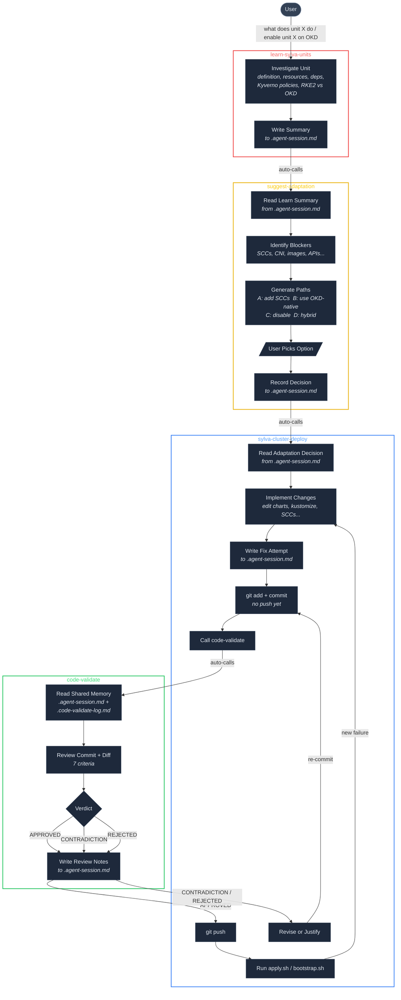
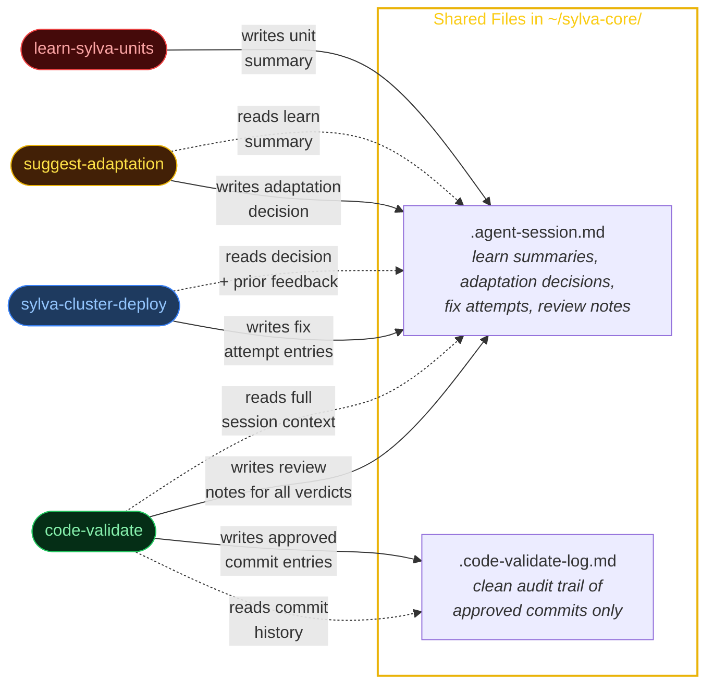
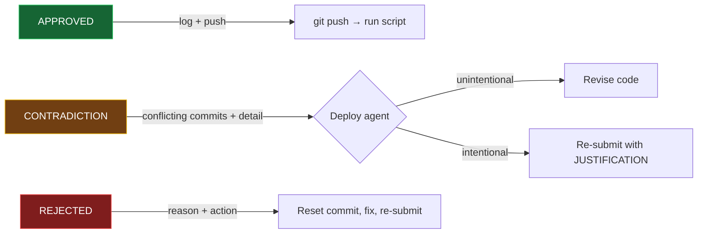

# Claude Skills

Cursor agent skills for Sylva infrastructure automation.

## Skills

### learn-sylva-units

Deep-dive into what a Sylva unit does across all cluster distributions (RKE2, OKD, etc.). Investigates unit definitions, resources, dependencies, Kyverno policies, and cross-distribution behavior. Automatically calls **suggest-adaptation** when done.

```
learn-sylva-units/
└── SKILL.md
```

---

### suggest-adaptation

Proposes adaptation paths for enabling a Sylva unit on OKD/OCP. Takes the Learn output, identifies blockers, generates multiple options (add SCCs, use OpenShift-native, hybrid, disable), and presents them for the user to choose. Automatically calls **sylva-cluster-deploy** after the user picks.

```
suggest-adaptation/
└── SKILL.md
```

---

### sylva-cluster-deploy

Deploy, repair, and redeploy Sylva OKD management clusters on bare metal (cabpoa/capm3). Also the final step in the Learn → Suggest → Deploy pipeline. All code changes go through **code-validate** before being pushed.

**Capabilities:**

- Full redeploy from scratch (teardown + bootstrap.sh)
- Repair mode (diagnose failures, apply fixes, retry)
- Active monitoring of kustomizations, HelmReleases, pods, and ACI events
- Known issue catalog with tested fixes
- Automatic retry loop until all Sylva units are ready

```
sylva-cluster-deploy/
├── SKILL.md
├── encountered-issues.md
├── known-issues.md
└── scripts/
    └── check-cluster-health.sh
```

---

### code-validate

Gate-keeper agent that reviews code changes before they are pushed. Called as a sub-agent by sylva-cluster-deploy after committing but before pushing.

**What it does:**

- Reads the shared session context to understand the full session history
- Reviews commit diffs for purpose alignment, scope limitation, and regressions
- Checks for contradictions with previously approved commits
- Returns `APPROVED`, `CONTRADICTION`, or `REJECTED` with actionable details
- Logs approved commits to a clean audit trail
- Supports re-submission with justification for intentional contradictions

```
code-validate/
└── SKILL.md
```

---

## Shared Agent Memory

All agents read and write shared files in `~/sylva-core/`:

| File | Purpose | Writers |
|------|---------|---------|
| `.agent-session.md` | Shared memory — session goal, learn summaries, adaptation decisions, fix attempts, review notes | All agents |
| `.code-validate-log.md` | Clean audit trail of approved commits only | code-validate |

## Architecture

Four-agent system for understanding, adapting, deploying, and validating Sylva units on OKD clusters.

### Agent Pipeline



### Shared Memory



### Decision Outcomes



---

## Setup

Git clone the repo to home directory:

```bash
git clone https://github.com/AbhishekBandarupalle/claude-skills.git ~/claude-skills
```

If using Cursor, add symlinks for Cursor:

```bash
ln -s ~/claude-skills/learn-sylva-units ~/.cursor/skills/learn-sylva-units
ln -s ~/claude-skills/suggest-adaptation ~/.cursor/skills/suggest-adaptation
ln -s ~/claude-skills/sylva-cluster-deploy ~/.cursor/skills/sylva-cluster-deploy
ln -s ~/claude-skills/code-validate ~/.cursor/skills/code-validate
```

If using Claude Code, add symlinks for Claude:

```bash
ln -s ~/claude-skills/learn-sylva-units ~/.claude/learn-sylva-units
ln -s ~/claude-skills/suggest-adaptation ~/.claude/suggest-adaptation
ln -s ~/claude-skills/sylva-cluster-deploy ~/.claude/sylva-cluster-deploy
ln -s ~/claude-skills/code-validate ~/.claude/code-validate
```

