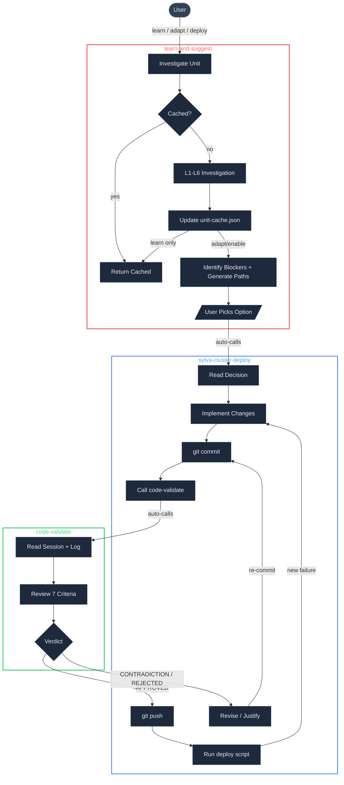
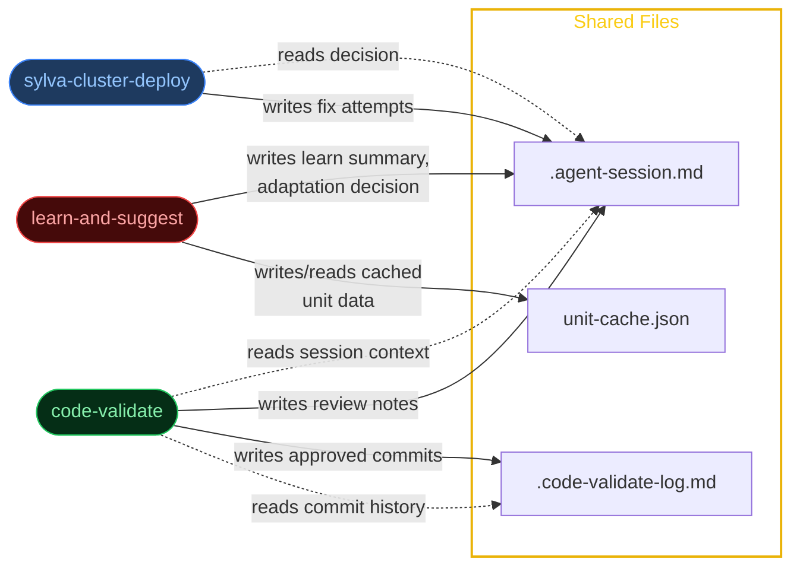
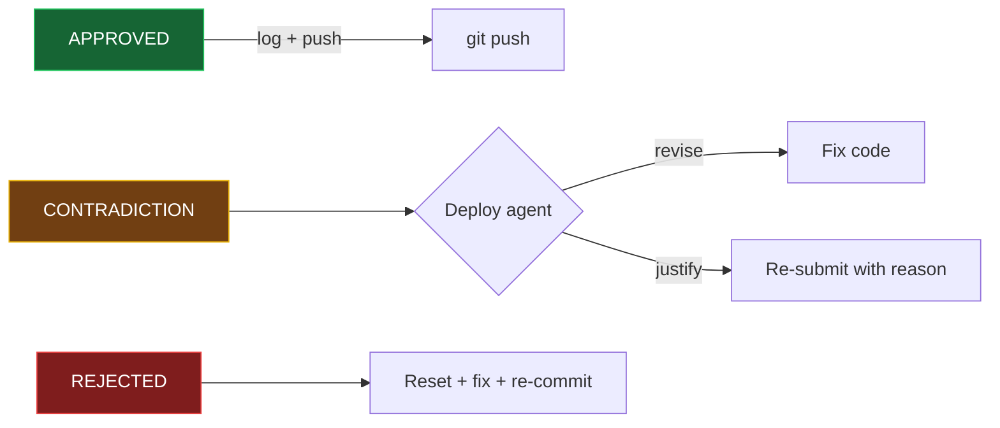

# Claude Skills

Cursor agent skills for Sylva infrastructure automation.

## Usage

All commands go through the `/sylva` dispatcher:

```
/sylva learn about <unit>                    — investigate what a unit does
/sylva enable <unit> on management cluster   — learn + suggest + deploy pipeline
/sylva enable <unit> on workload cluster     — same, targeting workload
/sylva disable <unit> on management cluster  — disable unit locally (no commit)
/sylva deploy management                     — redeploy management from scratch
/sylva deploy ocp workload cluster           — deploy OCP workload cluster
/sylva deploy okd workload cluster           — deploy OKD workload cluster
/sylva troubleshoot management cluster       — diagnose and fix management
/sylva troubleshoot workload cluster         — diagnose and fix workload
/sylva refresh <unit>                        — re-investigate a cached unit
/sylva what depends on <unit>                — dependency lookup from cache
```

### Environment Variables

Set these to skip env path prompts:

| Variable | Purpose | Default |
|----------|---------|---------|
| `SYLVA_MGMT_ENV` | Management cluster env values path | `environment-values/my-okd-capm3` |
| `SYLVA_WC_ENV` | Workload cluster env values path | auto-detect from command |

## Skills

### sylva (dispatcher)

Unified entry point. Parses `/sylva` commands, detects environment paths from
shell variables, and routes to the correct agent.

```
sylva/
└── SKILL.md
```

---

### learn-and-suggest

Investigate what a Sylva unit does across distributions (RKE2, OKD) and suggest OKD adaptation paths. Caches results to `unit-cache.json` for fast repeat lookups.

**Two modes:**
- **Learn only**: "what does unit X do?" — returns cached or fresh investigation
- **Learn + Suggest + Deploy**: "enable unit X on OKD" — full pipeline

```
learn-and-suggest/
└── SKILL.md
```

---

### sylva-cluster-deploy

Deploy, repair management clusters and workload clusters. Also the final step in the Learn → Suggest → Deploy pipeline. All code changes go through **code-validate** before push.

**Modes:**
- Management Redeploy — teardown + bootstrap.sh
- Management Repair — diagnose, fix, retry
- Workload Deploy — apply-workload-cluster.sh
- Workload Repair — investigate, fix, push, redeploy

```
sylva-cluster-deploy/
├── SKILL.md                  # Core: env rules, commit procedure, mode selection
├── mgmt-redeploy.md          # Management redeploy
├── mgmt-repair.md            # Management repair + monitoring + diagnosis
├── workload-deploy.md         # Workload deploy + repair
├── encountered-issues.md
├── known-issues.md
└── scripts/
    └── check-cluster-health.sh
```

---

### code-validate

Gate-keeper that reviews commits before push. Returns `APPROVED`, `CONTRADICTION`, or `REJECTED`.

```
code-validate/
└── SKILL.md
```

---

## Shared Memory

| File | Purpose | Writers |
|------|---------|---------|
| `.agent-session.md` | Compact session context — goal, fix attempts, review notes | All agents |
| `.code-validate-log.md` | Audit trail of approved commits | code-validate |
| `~/claude-skills/unit-cache.json` | Cached unit investigations + dependency graph | learn-and-suggest |

## Architecture

Three-agent pipeline for understanding, deploying, and validating Sylva units.

### Agent Pipeline



### Shared Memory Flow



### Validation Outcomes



---

## Setup

Git clone the repo to home directory:

```bash
git clone https://github.com/AbhishekBandarupalle/claude-skills.git ~/claude-skills
```

If using Cursor, add one symlink for the dispatcher only:

```bash
ln -s ~/claude-skills/sylva ~/.cursor/skills/sylva
```

If using Claude Code, add one symlink for the dispatcher only:

```bash
ln -s ~/claude-skills/sylva ~/.claude/sylva
```

Sub-agent skills (learn-and-suggest, sylva-cluster-deploy, code-validate) do not
need symlinks. The `/sylva` dispatcher calls them by file path directly.

Optionally set environment variables in your shell profile:

```bash
export SYLVA_MGMT_ENV=environment-values/my-okd-capm3
export SYLVA_WC_ENV=environment-values/workload-clusters/okd-capm3
```
